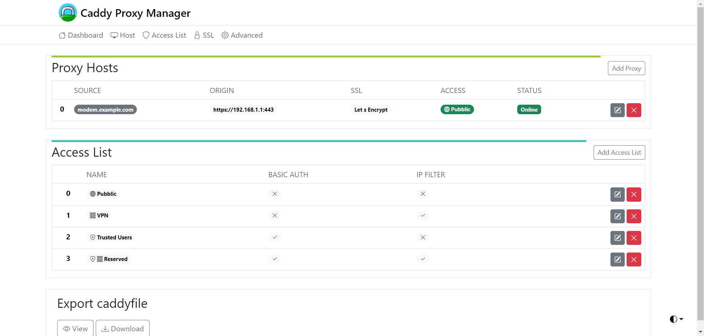

  <!-- <svg width="120" height="120" xmlns="http://www.w3.org/2000/svg">
    <rect x="0" y="0" width="120" height="120" rx="5" ry="5" fill="mediumpurple" />
    <text x="50%" y="50%" text-anchor="middle" fill="white" font-size="larger" font-weight="bold" font-family="Arial" dy=".3em">CaddyConfig</text>
  </svg> -->
  
    
   

 

<!-- [« LAUNCH DEMO »]() -->

# Caddyconfig
### (Maybe) A clone of caddyconfig.io in early dev.
> Dato che tentare di imitare https://nginxconfig.io/ (per ora) è troppo complesso da costruire senza cadere in tecnicismi, un clone di Nginx Proxy Manager semplifica notevolmente le possibili configurazioni.

> ⚠️ Nota: nulla di tutto ciò è minimamente stabile, tutto è in continua modifica commit per commit, per ora i file sono solo html e css senza js.

### Scelta del frontend e linguaggio
Ho scelto HTML e JS come base perchè:
1. È leggerissimo e lo si può modificare senza (quasi) nessuna conoscenza di base. (Con React o Vue è richiesta una conoscenza di base superiore rispetto a JS)
2. Non è necessario hostarlo e non memorizza chiavi quindi non vi è rischio di compromissione/dataleak/"hacking"
3. I dati rimangono nella sessione del browser e scadono alla chiusura di esso.

Ho scelto Bootstrap perchè è gratuito, è facile da usare è un compromesso molto buono tra tempo speso in frontend e risultato ottenuto. (Non ho molto tempo da dedicare alle interfacce grafiche)

### Qualche screen della base frontend

> Notabene: le schermate sono solo html e css per ora.
